<a name="readme-top"></a>
<div align="center">
  <!-- Logo -->
  <a href="https://github.com/dpetrosy/Fractal">
  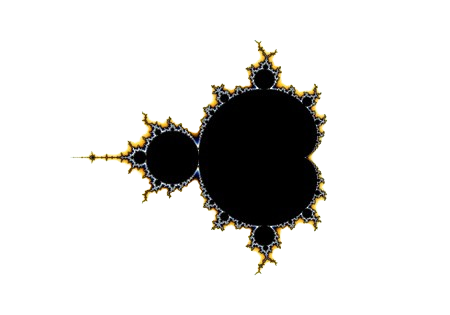
  </a>

  <!-- Project Name -->
  <h1>Fractal Project</h1>

  <!-- Badges -->
  <p>
    
    
    
    
  </p>

  <h3>
    <a href="#-about-project">📜 About Project</a>
      <span> · </span>
    <a href="#-fractals-list">📑 Fractals List</a>
      <span> · </span>
	  <a href="#-controls">🎮 Controls</a>
      <span> · </span>
    <a href="#-usage">👨‍💻 Usage</a>
      <span> · </span>
    <a href="#-screenshots">🌄 Screenshots</a>
  </h3>
</div>

---

## 📜 About Project

A fractal is a fragmented geometrical figure that infinitely repeats at smaller scales. \
So this project generates beautiful fractals from the complex numbers of an iterative mathematical construct. \
For graphics, I used [SFML](https://www.sfml-dev.org/index.php) library and [NVIDIA CUDA Toolkit](https://developer.nvidia.com/cuda-toolkit) for parallel computing. \
Project builds by [CMake](https://cmake.org/) build system, so if you do not have CUDA Toolkit or your platform doesn't have
CUDA support, CMake will build this project without CUDA support and computing will be done through CPU threads. \
By default, there will be **40 parallel threads**, the color is rgb(21, 0, 0) and the window size is 800px.

> [!NOTE]  
> If you want to change color, threads count, window size, or other defaults, change them in **helpers.hpp** file.

## 📑 Fractals List

The program supports these fractal sets:

| Name               | Formula                                                                                                  |
|:------------------:|:--------------------------------------------------------------------------------------------------------:|
| Mandelbrot         | $z_{n+1} = z_n^2 + c, z_0 = 0$                                                                           |
| Julia              | $z_{n+1} = z_n^2 + c, z_0 = c$                                                                           |
| Burning Ship       | $z_{n+1} = abs(z_n^2) + c, z_0 = 0$                                                                      |
| Tricorn            | $z_{n+1} = \overline{z_n}^2 + c, z_0 = 0$                                                                |
| Mandelbox          | It's more complex, see [this article](https://sites.google.com/site/mandelbox/what-is-a-mandelbox)       |
| Multibrot          | $z_{n+1} = z_n^d + c, z_0 = 0, d = 5$                                                                    |
| Mandelbar          | Take a look at **Mandelbar 5th (horizontal)** in [this image](README_files/Reference/Fractals_5th.png)   |
| Per. Burning Ship  | Take a look at **Perpendicular Burning Ship** in [this image](README_files/Reference/Mandelbrot_set.png) |
| Celtic Mandelbrot  | Take a look at **Celtic Mandelbrot** in [this image](README_files/Reference/Mandelbrot_set.png)          |

## 🎮 Controls

The program supports the following controls:

| Key           | Description                             |
|:-------------:|:---------------------------------------:|
| ESC           | Close the program window                |
| Keys [1-9]    | Move to another fractal                 |
| Key R         | Change the red component of fractal     |
| Key G         | Change the green component of fractal   |
| Key B         | Change the blue component of fractal    |
| Mouse Scroll  | Zoom in and out of the fractal          |
| ⬆️ ⬇️ ⬅️ ➡️ | Change the viewpoint                    |
| Key L         | Lock Julia's fractal                    |
| Zero          | Reset the fractal to its initial state  |

## 👨‍💻 Usage
### Requirements

The program is written in C++ and thus needs the **g++ compiler** and some standard **C++ libraries** to run. \
Also needs to install **SFML** library and **CMake**. If you want to use your NVIDIA GPU power, you need to install **NVIDIA CUDA Toolkit**.

### Instructions

**1. Compiling the program**

To build the release version, run these commands:

```shell
$ cd path/to/fractal
$ mkdir Release
$ cd Release
$ cmake -DCMAKE_BUILD_TYPE=Release ..
$ make
```

To build the debug version, run these commands:

```shell
$ cd path/to/fractal
$ mkdir Debug
$ cd Debug
$ cmake -DCMAKE_BUILD_TYPE=Debug ..
$ make
```

**2. How to run the program**

Run the executable too see the help message:
```shell
./fractal
```

Or run with some supported fractal:
```shell
./fractal mandelbrot
```

> [!NOTE]  
> For CUDA support, you need to install CMake version >= **3.24** \
> If you want to disable CUDA support, just uncommnet line 19 in **CMakeLists.txt file**.

# 🌄 Screenshots

## Mandelbrot
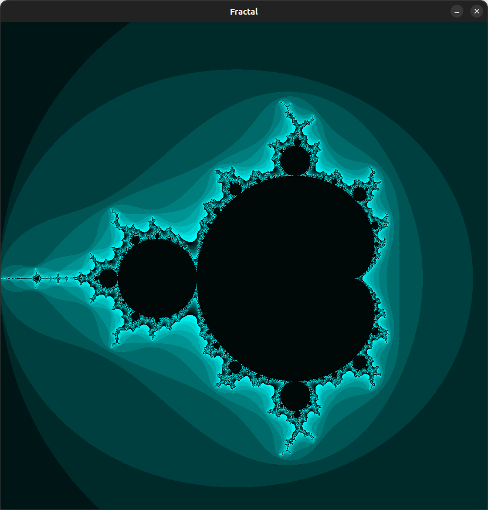
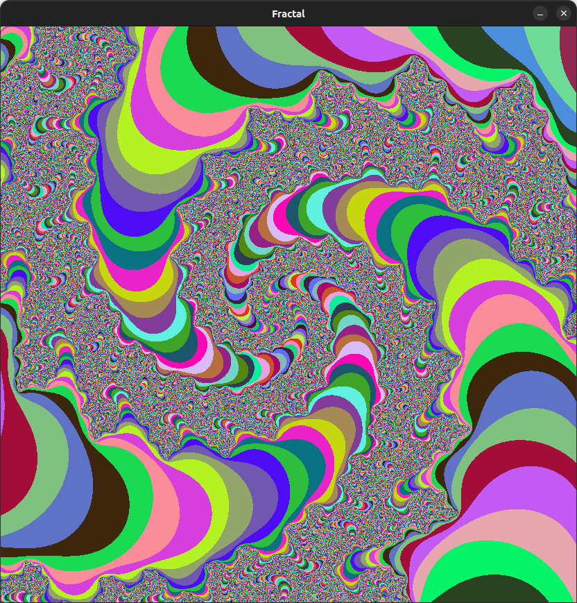

## Julia
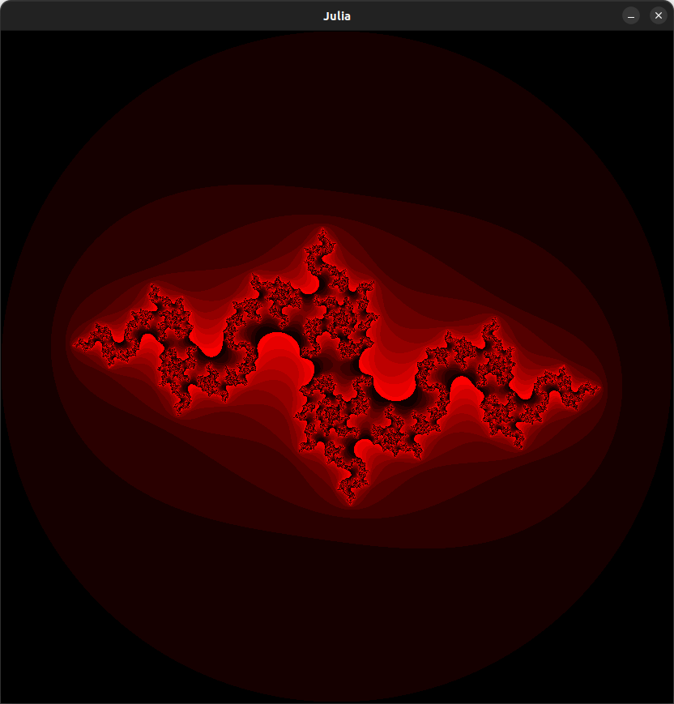

## Burning Ship
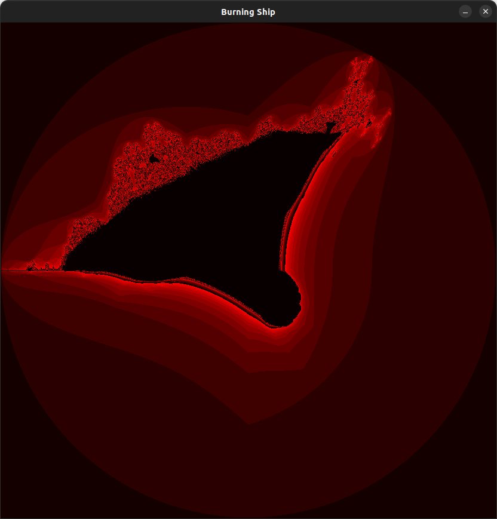

## Tricorn
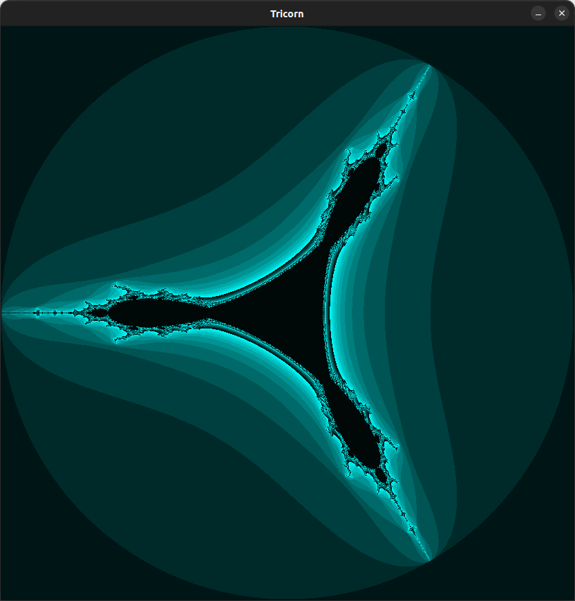

## Mandelbox
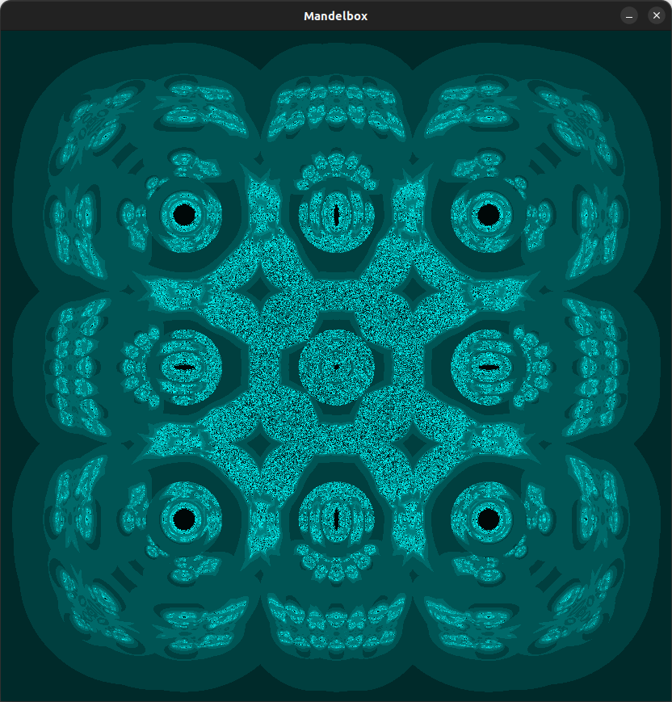

## Multibrot
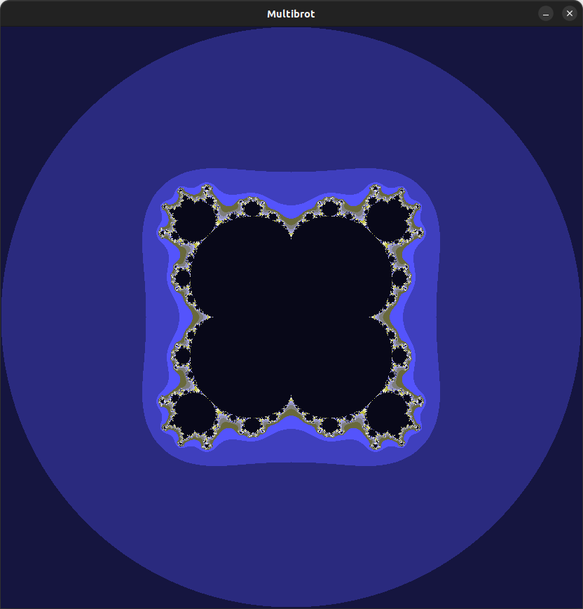

## Mandelbar
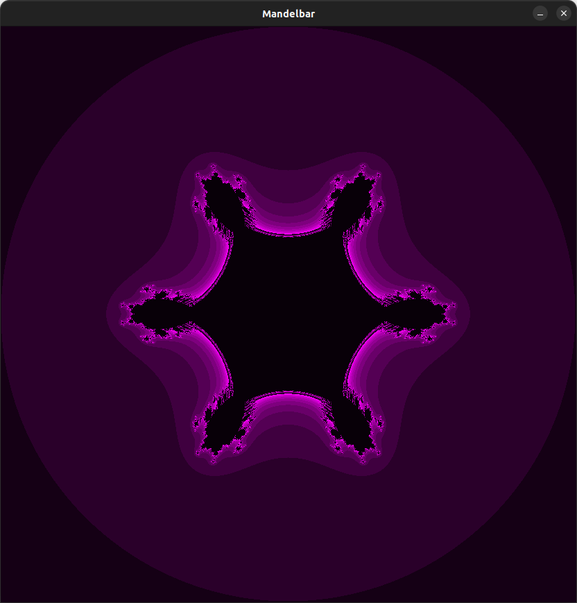

## Perpendicular Burning Ship
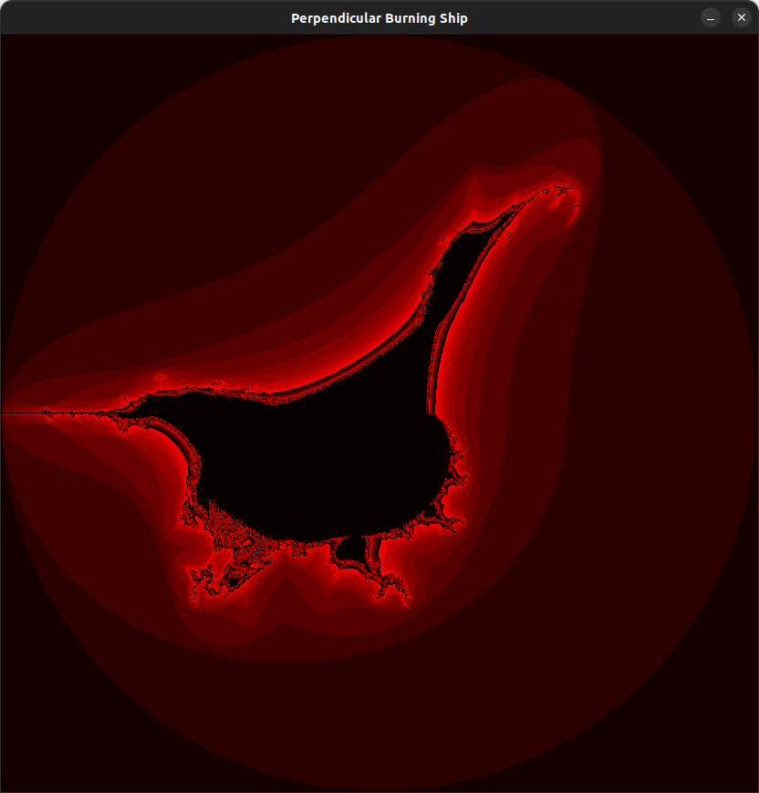

## Celtic Mandelbrot
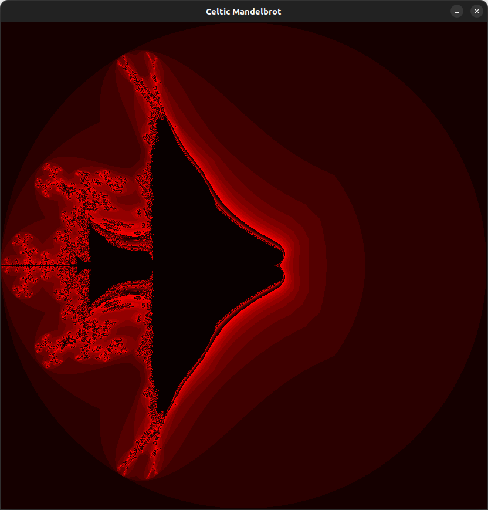
