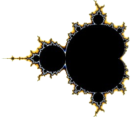

  <!-- Logo -->
  

  <!-- Project Name -->
  <h1>Fractal Project</h1>

  <!-- Badges -->
  

    
    
    
    
  

  <h3>
    <a href="#-about-project">📜 About Project</a>
       · 
    <a href="#-fractals-list">📑 Fractals List</a>
       · 
	  <a href="#-controls">🎮 Controls</a>
       · 
    <a href="#-usage">👨‍💻 Usage</a>
       · 
    <a href="#-screenshots">🌄 Screenshots</a>
  </h3>

---

## 📜 About Project

A fractal is a fragmented geometrical figure that infinitely repeats at smaller scales. \
So this project generates beautiful fractals from the complex numbers of an iterative mathematical construct. \
For graphics, I used **SFML** library and **NVIDIA CUDA Toolkit** for parallel computing. \
Project builds by **CMake** build system, so if you do not have CUDA Toolkit or your platform doesn't have
CUDA support, CMake will build this project without CUDA support and computing will be done through CPU threads. \
By default, there will be 40 parallel threads, the color is rgb(21, 0, 0) and the window size is 800px.

> [!NOTE]  
> If you want to change color, threads count, window size, or other defaults, change them in helpers.hpp file.
